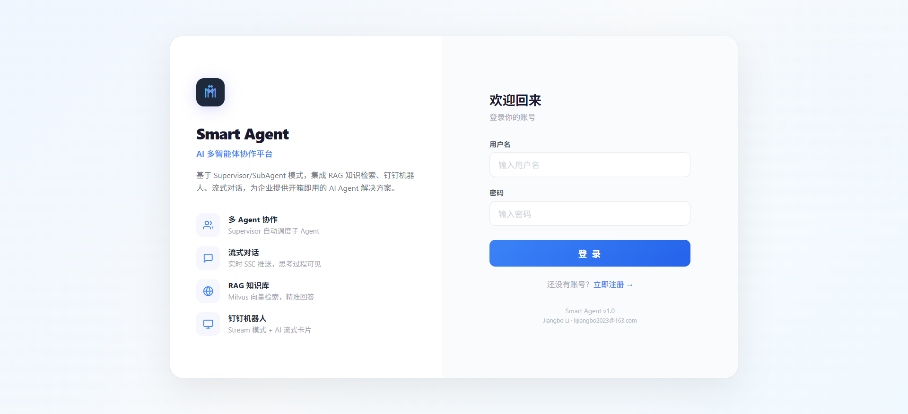
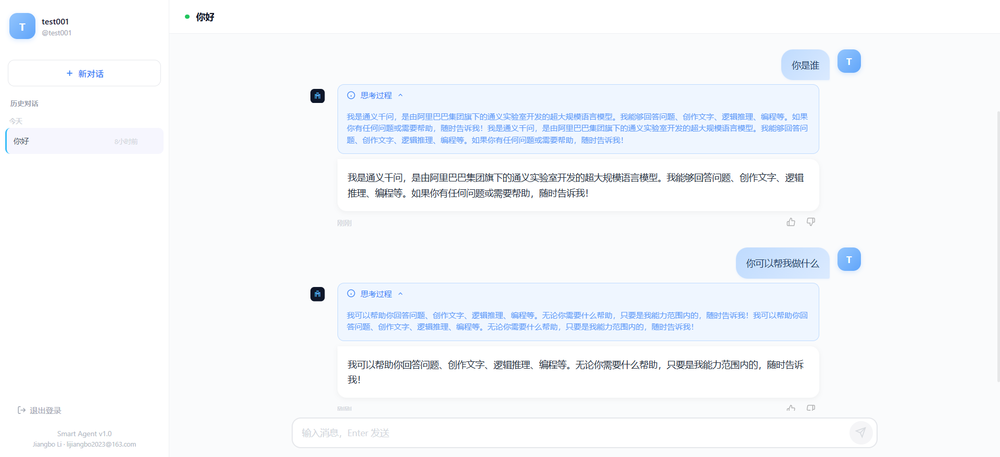
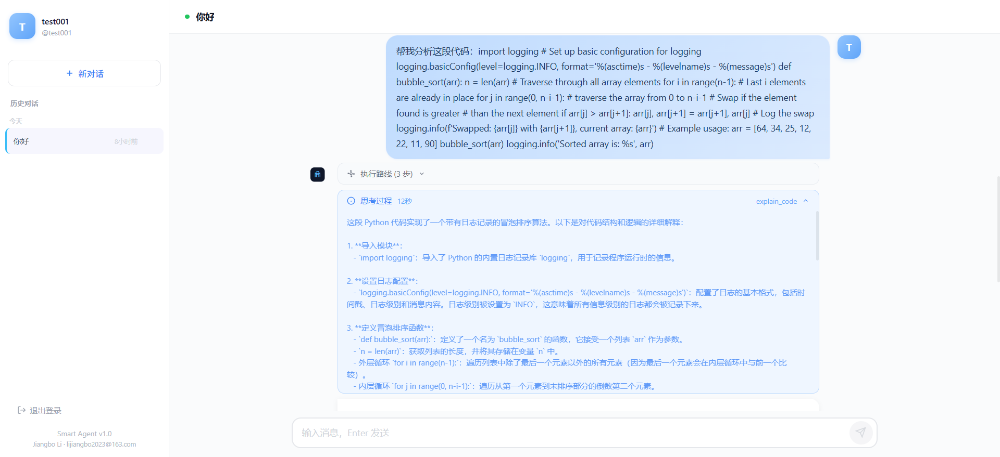
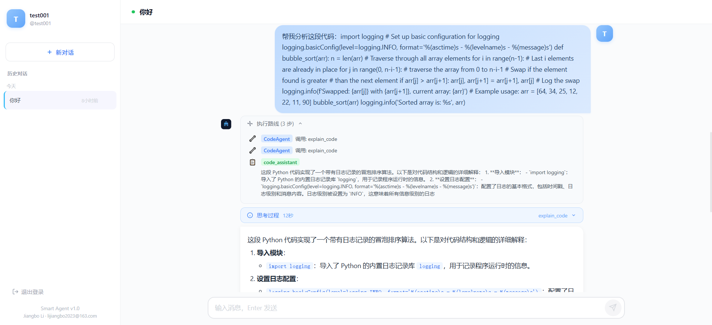
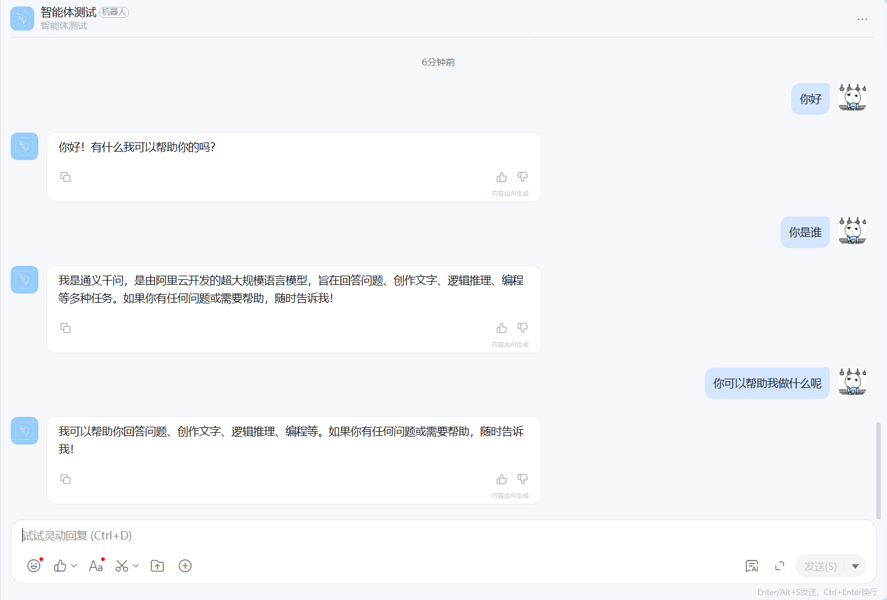
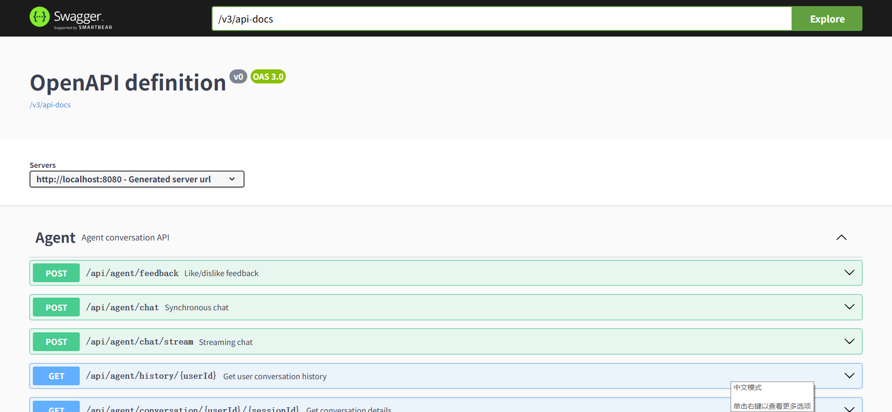

# Smart Agent Framework

**English** | [中文文档](README_ZH.md)

A general-purpose AI Agent development framework based on **Spring Boot 3.x + AgentScope + Vue 3**, supporting rapid construction of AI agents with conversation via **HTTP API** or **DingTalk Bot**.

> 🚀 **5-minute quick start**: Copy `.env.example` → `.env` → fill in `LLM_API_KEY` → `docker compose up -d` → open http://localhost:5173

## Before You Start

- [ ] JDK 21+ installed (`java -version`)
- [ ] Docker Desktop installed (for quick start) **OR** MySQL 8.x running locally
- [ ] DashScope API Key from https://dashscope.console.aliyun.com/ (free signup, free tokens)
- [ ] Ports 8080, 5173 available (change in config if occupied)

## Features

| Feature | Description |
|---------|-------------|
| Supervisor/SubAgent Orchestration | Supervisor pattern with data-driven auto-registration of sub-agents |
| ReAct Reasoning | AgentScope ReActAgent with function calling support |
| Memory Persistence | SlidingWindowMemory + DatabaseSession, shared across instances |
| Session Concurrency Lock | Serializes requests per session to prevent data overwrites |
| Automatic Data Cleanup | Scheduled cleanup of sessions and messages with configurable retention |
| Sensitive Data Masking | Auto-masking of phone numbers and ID numbers across all API outputs |
| Redis Enhancement | Distributed lock, session cache, token sharing, rate limiting, message dedup (optional) |
| RAG Knowledge Retrieval | Milvus vector database + DashScope Embedding (optional) |
| MCP Client | Standard MCP protocol (HTTP/SSE) for external tool integration (optional) |
| Tool Call | AgentScope native tool calling |
| Dynamic Configuration | Nacos hot-reload for prompts and system config (optional) |
| Skill System | Classpath + Git repository dynamic loading |
| DingTalk Bot | Stream mode + AI streaming cards, single-chat only (optional) |
| Vue 3 Frontend | Conversation history + chat details + tool call/reasoning display |
| Swagger API | springdoc-openapi, ready out of the box |

## Tech Stack

| Component | Solution |
|-----------|----------|
| Backend Framework | Spring Boot 3.3.6 + Java 21 |
| Agent Framework | AgentScope 1.0.12 |
| Config Center | Nacos 2.4.x (optional) |
| Database | MySQL 8.x + Druid |
| Cache | Redis 7.x + Lettuce (optional) |
| Vector Database | Milvus 2.x (optional) |
| LLM | DashScope OpenAI-compatible API |
| Frontend | Vue 3 + Element Plus + DOMPurify |
| API Documentation | springdoc-openapi (Swagger UI) |

## Architecture

```
┌─────────────────────────────────────────────────────────────────────┐
│                         Browser (Vue 3)                             │
│                     http://localhost:5173                           │
│  ┌──────────┐  ┌──────────┐  ┌──────────────────────────────────┐  │
│  │  Login   │  │  Chat    │  │  ChatPanel                       │  │
│  │  JWT Auth│  │  History  │  │  Markdown · Thinking · Feedback │  │
│  └──────────┘  └──────────┘  └──────────────────────────────────┘  │
└─────────────────────────────┬───────────────────────────────────────┘
                              │ HTTP / SSE (Vite proxy :5173 → :8080)
┌─────────────────────────────▼───────────────────────────────────────┐
│                   Spring Boot 3.3 (8080)                            │
│                                                                     │
│  ┌───────────┐  ┌──────────────┐  ┌────────────────────────────┐  │
│  │ Auth      │  │ Agent        │  │ RAG                        │  │
│  │ register  │  │ chat · SSE   │  │ seed · search              │  │
│  │ login     │  │ history      │  │                            │  │
│  └───────────┘  └──────┬───────┘  └────────────────────────────┘  │
│                        │                                           │
│  ┌─────────────────────▼──────────────────────────────────────┐   │
│  │              SupervisorAgent (ReAct)                        │   │
│  │  Model: Qwen-Turbo  │  Prompt: Nacos hot-reload            │   │
│  └──────────┬──────────────────────────────┬──────────────────┘   │
│             │                              │                       │
│  ┌──────────▼──────────┐      ┌───────────▼──────────────────┐   │
│  │   DemoAgent         │      │   CodeAgent                  │   │
│  │   weather · calc    │      │   code-review · api-design   │   │
│  │   search · translate│      │   format · unit-test         │   │
│  │   knowledge_search  │      │   knowledge_search           │   │
│  └─────────────────────┘      └──────────────────────────────┘   │
│                                                                     │
│  ┌─────────────────────────────────────────────────────────────┐   │
│  │  Services: SessionLock · RateLimit · Cleanup · SkillLoader  │   │
│  └─────────────────────────────────────────────────────────────┘   │
└─────────────────────────────────────────────────────────────────────┘
                              │
          ┌───────────────────┼───────────────────┐
          ▼                   ▼                   ▼
┌──────────────────┐  ┌──────────────┐  ┌──────────────────┐
│     MySQL 8.0    │  │   Redis 7    │  │  DashScope (灵积) │
│  sessions        │  │   lock       │  │  Qwen-Max         │
│  messages        │  │   cache      │  │  Qwen-Turbo       │
│  users           │  │   rate-limit │  │  text-embedding   │
└──────────────────┘  └──────────────┘  └──────────────────┘
          │                   │
┌──────────────────┐  ┌──────────────┐  ┌──────────────────┐
│   Milvus 2.4     │  │  Nacos 2.3   │  │  DingTalk Stream │
│  ┌─ etcd ─────┐  │  │  prompts     │  │  WebSocket       │
│  │ ┌ MinIO ─┐ │  │  │  config      │  │  AI Cards        │
│  │ │ vectors│ │  │  │              │  │                  │
│  │ └────────┘ │  │  └──────────────┘  └──────────────────┘
│  └────────────┘  │
└──────────────────┘
```

## Frontend Screenshots

<p align="center"></p>
<p align="center"><em>Login Page</em></p>

<p align="center"></p>
<p align="center"><em>Chat Interface</em></p>

<p align="center"></p>
<p align="center"><em>Thinking Process &amp; Route Timeline</em></p>

<p align="center"></p>
<p align="center"><em>Sub-Agent Call Chain</em></p>

<p align="center"></p>
<p align="center"><em>DingTalk AI Streaming Card</em></p>

<p align="center"></p>
<p align="center"><em>Swagger API</em></p>

## Project Structure

```
smart-agent-framework/
├── pom.xml                    # Parent POM
├── start.sh                   # Start/stop/restart script (Linux/Mac)
├── start.bat                  # Start script (Windows)
├── smart-agent-core/          # Core module
│   ├── agent/                 #   Supervisor, SubAgent, Memory, Session, SessionLock
│   ├── callback/chatbot/      #   DingTalk Stream callback handling
│   ├── component/             #   AgentChatComponent (chat orchestration)
│   ├── dingtalk/              #   DingTalk AccessToken, AI cards
│   ├── mcp/                   #   MCP Client configuration
│   ├── nacos/                 #   Prompt hot-reload, system config management
│   ├── persistence/           #   Entity, Mapper
│   ├── rag/                   #   Embedding, Milvus, RagService
│   ├── service/               #   Message service, conversation mapping service
│   └── util/                  #   JsonUtils, SensitiveUtils, SseEventHelper
├── smart-agent-start/         # Startup module
│   ├── controller/            #   REST API Controller
│   ├── demo/                  #   Example SubAgent and tools
│   └── resources/             #   application.yml, logback-spring.xml
├── smart-agent-ui/            # Vue 3 frontend
└── README.md
```

## Quick Start

### 📝 First: Fill in your API Keys & Passwords

**All secrets go in a single file: `.env`**

```bash
# 1. Copy the template
cp .env.example .env

# 2. Edit .env — fill in at minimum:
#    LLM_API_KEY=sk-your-real-key    ← from https://dashscope.console.aliyun.com/
#    DB_PASSWORD=your-db-password    ← your MySQL root password

# 3. .env is in .gitignore — NEVER committed to Git
```

> **Where to find your DashScope API Key?** Visit [Alibaba Cloud DashScope Console](https://dashscope.console.aliyun.com/) → API-KEY Management. New users get free tokens.

### Docker Compose (Recommended — Quick Start)

```bash
# Build and start all services (MySQL, Redis, Milvus, Nacos, App)
docker compose up -d --build

# Access:
#   Frontend:  http://localhost:5173   (register first, then chat)
#   Swagger:   http://localhost:8080/swagger-ui.html
```

### Windows

```cmd
REM Copy config
copy .env.example .env
REM Edit .env with Notepad — fill in LLM_API_KEY

REM Option A: Docker Compose (recommended)
docker compose up -d --build

REM Option B: Maven (requires local MySQL)
start.bat           REM local profile
start.bat dev       REM dev profile
```

### Linux / macOS

```bash
cp .env.example .env
# Edit .env with your values

# Option A: Docker Compose (recommended)
docker compose up -d --build

# Option B: Maven
./start.sh              # Foreground, local profile
./start.sh -d -e dev    # Background, dev profile
```

### Prerequisites (Manual Setup)

Dependencies are divided into "required" and "optional":

| Type | Component | Purpose | Impact if Missing |
|------|-----------|---------|-------------------|
| Required | JDK 21+ | Runtime | Cannot start |
| Required | Maven 3.9+ | Build tool | Cannot build |
| Required | MySQL 8.x | Session & message persistence | Cannot start |
| Required | DashScope API Key | LLM inference | Cannot chat |
| Optional | Node.js 18+ | Frontend development | No Vue UI, but API still works |
| Optional | Nacos 2.x | Prompt hot-reload + system config (required for DingTalk) | No hot-reload, DingTalk bot disabled |
| Optional | Milvus 2.x | RAG knowledge retrieval | RAG auto-disabled, other features work |

> **Minimal setup**: Just JDK 21 + MySQL + DashScope API Key to get conversation working.

### 1. Get a DashScope API Key (Most Critical Step)

1. Visit [Alibaba Cloud DashScope Console](https://dashscope.console.aliyun.com/)
2. Log in with Alipay/Taobao account and complete verification
3. Create an API Key in "API-KEY Management" (format: `sk-xxxxxxxxxx`)
4. **Free credits**: New users receive millions of free tokens — no top-up needed for development with `qwen-plus` and other models

Recommended models:

| Model | Use Case |
|-------|----------|
| `qwen-plus` / `qwen3-plus` | Main Agent reasoning (default) |
| `qwen-turbo` | Sub-agents / fast response |
| `text-embedding-v2` / `v3` | RAG embedding |

### 2. Database Initialization

```bash
mysql -u root -p < smart-agent-core/src/main/resources/schema.sql
```

This creates the `smart_agent` database with three tables:

| Table | Purpose |
|-------|---------|
| `agent_session` | Agent session memory storage |
| `agent_chat_message` | User-Agent conversation messages |
| `agent_conversation_session_mapper` | Conversation-to-Session mapping (reserved, not yet active) |

### 3. Configure Environment Variables

All configuration is in `.env` (copy from `.env.example`):

```bash
cp .env.example .env
```

Edit `.env` and fill in values. The app reads all config from these variables via `${VAR:default}` syntax in `application.yml`.

**Minimum required** for basic chat:

```bash
LLM_API_KEY=sk-your-real-key      # Get from https://dashscope.console.aliyun.com/
DB_PASSWORD=your-mysql-password
```

**Docker Compose** reads `.env` automatically.  
**Manual start** on Linux/macOS: `source .env && ./start.sh`  
**Manual start** on Windows: set system environment variables or use IDE run config.

### 4. Start the Backend

```bash
cd smart-agent-framework
mvn clean install -DskipTests

# Option 1: Start script (recommended)
./start.sh                # Foreground
./start.sh -d             # Background (daemon)
./start.sh -d -p 9090     # Background + custom port
./start.sh -s             # Stop
./start.sh -r             # Restart

# Option 2: Maven directly
cd smart-agent-start
mvn spring-boot:run
```

### 5. Verify Startup

Several ways to confirm the application is running correctly:

```bash
# 1. Check process and port
lsof -i:8080

# 2. Visit Swagger (most intuitive)
open http://localhost:8080/swagger-ui.html

# 3. Send a test conversation
curl -X POST http://localhost:8080/api/agent/chat \
  -H "Content-Type: application/json" \
  -d '{"userId":"test","sessionId":"s1","message":"hello"}'
```

A JSON response should be returned, and LLM call logs visible in `~/smart-agent/logs/log_info.log`. If it fails, see the [Troubleshooting](#troubleshooting) section below.

### 6. Start the Frontend (Optional)

```bash
cd smart-agent-ui
npm install
npm run dev
```

Visit http://localhost:5173 to use the chat interface.

## Environments

| Profile | File | Skills Source | Auth | CORS | Swagger |
|---------|------|:---:|:---:|:---:|:---:|
| `local` | `application-local.yml` | Local directory | Off | `*` | On |
| `dev` | `application-dev.yml` | Git repo | Off | `*` | On |
| `staging` | `application-staging.yml` | Git repo | On | Configured | On |
| `prod` | `application-prod.yml` | Git repo | On | Configured | Off |

Switch via: `SPRING_PROFILES_ACTIVE=dev` or `./start.sh -e dev`

## API Endpoints

| Method | Path | Description |
|--------|------|-------------|
| POST | `/api/auth/register` | User registration |
| POST | `/api/auth/login` | User login (returns JWT token) |
| GET | `/api/auth/verify` | Verify JWT token |
| POST | `/api/agent/chat` | Synchronous chat |
| POST | `/api/agent/chat/stream` | Streaming chat (SSE) |
| GET | `/api/agent/history/{userId}?page=1&size=20` | Get user conversation history |
| GET | `/api/agent/conversation/{userId}/{sessionId}` | Get conversation details |
| POST | `/api/agent/feedback` | Like/dislike feedback |
| POST | `/api/rag/seed` | Seed knowledge base with sample docs |
| GET | `/api/rag/search?query=xxx` | Search knowledge base |

> **Note**: All chat endpoints apply sensitive data masking to Agent output (phone numbers and ID numbers auto-masked). Concurrent requests for the same user+session are rejected with "This session is being processed, please try again later."

### Synchronous Chat Example

```bash
curl -X POST http://localhost:8080/api/agent/chat \
  -H "Content-Type: application/json" \
  -d '{"userId": "user001", "sessionId": "test001", "message": "hello"}'
```

### Streaming Chat Example

```bash
curl -N -X POST http://localhost:8080/api/agent/chat/stream \
  -H "Content-Type: application/json" \
  -d '{"userId": "user001", "sessionId": "test001", "message": "hello"}'
```

### Like/Dislike Feedback Example

```bash
curl -X POST http://localhost:8080/api/agent/feedback \
  -H "Content-Type: application/json" \
  -d '{"messageId": 1, "action": "like", "currentStatus": "none"}'
```

`action` only supports `like` and `dislike`. Submitting the same action again cancels the feedback.

## Security & Data Governance

### Sensitive Data Masking

The framework includes `SensitiveUtils` which automatically masks sensitive data in all API outputs:

| Data Type | Masking Rule | Example |
|-----------|-------------|---------|
| Phone (11 digits) | Keep first 3 + last 4, mask middle 4 | `13812345678` → `138****5678` |
| ID Card (18 digits) | Keep first 6 + last 4, mask middle 8 | `110101199001011234` → `110101**********1234` |

Masking coverage: synchronous chat, streaming chat, history list, conversation details.

### Session Concurrency Lock

Only one request per user+session is allowed at a time, preventing concurrent requests from overwriting session data.

- **Single instance**: In-memory lock (`SessionLockService`), auto-released after 10-minute timeout
- **Multi-instance**: Requires distributed lock (Redis SETNX + TTL or MySQL row lock). Configure `redis.url` to auto-activate Redis-based lock.

Concurrent requests receive an HTTP 500 error with message "This session is being processed, please try again later."

### Automatic Data Cleanup

Built-in scheduled task runs daily at 3:00 AM to clean up expired data:

| Data Type | Default Retention | Config Key |
|-----------|:---:|------|
| Agent session memory (`agent_session`) | 7 days | `cleanup.session.retention-days` |
| Chat messages (`agent_chat_message`) | 90 days | `cleanup.message.retention-days` |

Customize in `application.yml`:

```yaml
cleanup:
  session:
    retention-days: 7
  message:
    retention-days: 90
```

## DingTalk Bot Integration

Develop and debug locally using DingTalk Bot Stream mode.

### Prerequisites

All of the following are **required**:

1. **DingTalk account**: Regular account, no enterprise verification needed
2. **Nacos config center**: DingTalk sensitive config (AppKey/AppSecret/RobotCode etc.) **must** be managed via Nacos
3. **AI Interactive Card template** (optional but recommended): For streaming card replies; without it, only plain text replies are available

### Step 1: Create DingTalk App & Bot

1. Log in to [DingTalk Open Platform](https://open.dingtalk.com)
2. "App Development → Enterprise Internal App → Create App"
3. Set **Stream mode** for message receiving (no callback URL needed)
4. Add "Bot" capability to the app
5. Get **AppKey** and **AppSecret** from "Credentials & Basic Info"
6. Get **RobotCode** from the "Bot" configuration page

### Step 2: Required Permissions

Go to "Permissions" and apply for ALL three:

| Permission | Code | Purpose |
|-----------|------|---------|
| 企业内机器人发送消息 | `Robot.SendMessage` | Bot sends messages |
| 互动卡片实例写 | `Card.Instance.Write` | Create AI cards |
| AI卡片流式更新 | `Card.Streaming.Write` | Stream content updates |

> ⚠️ Missing `Card.Streaming.Write` will cause cards to show empty or return 403.

### Step 3: Create AI Card Template

1. Open Platform → "Interactive Cards" → "Create Template"
2. Select **AI Card** type (not regular card)
3. The template must have a Markdown component with key `content` for streamed text
4. Publish and copy the template ID (e.g., `xxxx.schema`)

### Step 4: Configure in Nacos

Ensure Nacos is running, create `system-config.json` in group `smart-agent`:

```json
{
  "dingtalk": {
    "appKey": "your-app-key",
    "appSecret": "your-app-secret",
    "robotCode": "your-robot-code",
    "aiCardTemplateId": "your-card-template-id"
  }
}
```

### Step 5: Publish and Enable

1. "Version Management" → "Create New Version" → **Publish**
2. Set `DINGTALK_STREAM_ENABLED=true` in `.env`
3. Restart application
4. Search bot name in DingTalk, start a private chat, @bot with a message

> After publishing, you must **re-publish** every time you change permissions or template.

## Nacos Configuration (Optional)

**Use cases**: Prompt hot-reload, system-level sensitive config (e.g. DingTalk credentials). **Without Nacos**, DingTalk bot is disabled, but HTTP API and Vue frontend are unaffected.

### Install & Start Nacos

```bash
wget https://github.com/alibaba/nacos/releases/download/2.4.3/nacos-server-2.4.3.zip
unzip nacos-server-2.4.3.zip
cd nacos/bin
sh startup.sh -m standalone
```

Visit http://localhost:8848/nacos (default credentials: nacos/nacos)

### Configure Prompt Hot-Reload

| Data ID | Group | Content |
|---------|-------|---------|
| `Supervisor-prompt` | `smart-agent` | Supervisor system prompt |
| `DemoAgent-prompt` | `smart-agent` | Demo sub-agent system prompt |

### Configure System Parameters

Data ID: `system-config.json`, Group: `smart-agent`:

```json
{
  "dingtalk": {
    "appKey": "your-dingtalk-app-key",
    "appSecret": "your-dingtalk-app-secret",
    "robotCode": "your-robot-code",
    "aiCardTemplateId": "your-card-template-id"
  }
}
```

## RAG Knowledge Base (Optional)

**Use case**: Let Agent answer questions based on private knowledge. **Without Milvus, the application still runs normally** — RAG is auto-disabled, other features are unaffected.

### Start Milvus

```bash
wget https://raw.githubusercontent.com/milvus-io/milvus/master/scripts/standalone_embed.sh
bash standalone_embed.sh start
```

### Create Collection

```
Collection: knowledge_base
Fields:
  - id: VARCHAR(256), primary key
  - text: VARCHAR(65535)
  - vector: FLOAT_VECTOR(1024)
Index: IVF_FLAT on vector field
```

### Use in Agent

```java
@Autowired
private RagService ragService;

// Retrieve knowledge
String context = ragService.retrieve("user question");

// Index document
ragService.index("doc-001", "document content...");
```

## MCP Tool Integration (Optional)

The framework supports external tool servers via MCP protocol (HTTP/SSE transport). Since most official MCP servers use stdio transport, you need **supergateway** to bridge to SSE.

### Quick Test

1. Install and start MCP bridge:

```bash
npm install -g supergateway
npx -y supergateway --stdio "npx -y @modelcontextprotocol/server-everything" --port 3000
```

2. Configure in `application.yml`:

```yaml
mcp:
  server:
    url: http://localhost:3000/sse
    name: everything
```

3. Restart the application — Agent will automatically use MCP tools.

### Recommended MCP Servers

| MCP Server | Description | Start Command |
|------------|-------------|---------------|
| `@modelcontextprotocol/server-everything` | Test server (echo, add, etc.) | `npx -y supergateway --stdio "npx -y @modelcontextprotocol/server-everything" --port 3000` |
| `@modelcontextprotocol/server-fetch` | Web content fetching | `npx -y supergateway --stdio "npx -y @modelcontextprotocol/server-fetch" --port 3001` |
| `@modelcontextprotocol/server-filesystem` | File system operations | `npx -y supergateway --stdio "npx -y @modelcontextprotocol/server-filesystem /tmp" --port 3002` |

> **Note**: MCP is optional. Without an MCP Server, the framework runs normally — Agent only uses built-in @Tool tools.

## Troubleshooting

| Problem | Possible Cause | Solution |
|---------|---------------|----------|
| Docker Desktop won't start | **WSL version too old** (common on Windows) | Run `wsl --update` in **admin** PowerShell, then restart Docker Desktop |
| Docker pull timeout / connection refused | Docker Hub blocked by firewall (common in China) | Configure Docker mirror: Settings → Docker Engine → add `"registry-mirrors": ["https://hub.rat.dev"]` |
| `Table 'smart_agent.xxx' doesn't exist` | Database tables not created | Set `FLYWAY_ENABLED=true` or run `docker compose exec mysql mysql -uroot -p smart_agent < schema.sql` |
| Frontend shows "请求失败" | CORS issue or database not initialized | Check Tables exist in MySQL; restart smart-agent after DB init |
| DashScope connection failure / 401 | API Key not configured or invalid | Check `LLM_API_KEY` in `.env`; verify key in [DashScope Console](https://dashscope.console.aliyun.com/) |
| Nacos connection failure warning | Nacos not running or wrong address | Ignore if not using DingTalk/hot-reload; otherwise start Nacos and check `NACOS_SERVER_ADDR` |
| DingTalk bot "已读不回" | Permissions missing or config error | 1) Check `Card.Instance.Write` AND `Card.Streaming.Write` permissions; 2) Verify `system-config.json` in Nacos; 3) **Re-publish** the app after permission changes |
| DingTalk card shows no streaming, just jumps | Card template or `createAndDeliver` timing | Ensure AI Card template has `content` key markdown component; card lifecycle is managed by template auto state machine |
| Milvus connection warning | Milvus not running | Ignore if RAG not needed |
| Port 8080 occupied | Another app using the port | `./start.sh -d -p 9090` or change `docker-compose.yml` port mapping |
| Frontend "请求失败，请重试" | Backend error (check logs) | `docker compose logs smart-agent` to see the actual error |

## CORS Configuration

Allows all origins by default, **development use only**. Production environments **must** restrict to specific domains in `application.yml`:

```yaml
cors:
  allowed-origins: https://your-domain.com,https://admin.your-domain.com
```

> At startup, the framework checks the current profile: if not `local` and `cors.allowed-origins` is still `*`, a **WARN** log is emitted reminding you to configure specific domains.

## Redis Enhancement (Optional)

Configuring Redis auto-activates the following enhancements. **Without Redis, all features gracefully degrade to in-memory implementations — the application still starts normally.**

### Quick Setup

1. Install Redis 7.x (or 6.x):

```bash
# macOS
brew install redis && brew services start redis

# Docker
docker run -d --name redis -p 6379:6379 redis:7
```

2. Configure in `.env`:

```bash
REDIS_URL=localhost
# REDIS_PASSWORD=your-password   # Uncomment if password-protected
```

Or in `application.yml`:

```yaml
redis:
  url: localhost
  password: ""
```

### Activated Features

| Feature | Without Redis | With Redis |
|---------|:---:|:---:|
| **Session Lock** | In-memory, single-instance only | SETNX + TTL, multi-instance mutual exclusion |
| **Session Cache** | MySQL read/write per conversation | Read-Through cache, ~10x latency reduction for active sessions |
| **DingTalk Token Sharing** | Independent cache per instance, concurrent refresh on expiry | Global shared token + distributed refresh lock |
| **Rate Limiting** | No limit | Fixed-window counter, default 30 req/min/IP |
| **Message Dedup** | DingTalk redelivery may cause duplicate replies | SETNX dedup within 5 minutes |
| **Cleanup Task Lock** | Concurrent DELETE across instances may cause lock contention | Distributed lock ensures single-instance execution |

### Rate Limiting Configuration

```yaml
ratelimit:
  requests-per-minute: 30    # Max requests per IP per minute
```

Rate limiting only applies to `/api/agent/chat` and `/api/agent/chat/stream` endpoints. Exceeding the threshold returns HTTP 429.

### Multi-Instance Deployment

**Strongly recommended** to configure Redis for multi-instance deployments. Without it:

- Session locks cannot coordinate across instances; concurrent requests may overwrite session data
- Scheduled cleanup tasks run on every instance simultaneously, competing for MySQL row locks
- All instances refresh DingTalk tokens simultaneously on expiry, potentially triggering rate limits

## Extension Guide

### Add a Custom Sub-Agent

1. Implement the `AbstractSubAgent` interface:

```java
@Component
public class MySubAgentProvider implements AbstractSubAgent {

    private final OpenAIChatModel model;

    public MySubAgentProvider(@Qualifier("subDefaultModel") OpenAIChatModel model) {
        this.model = model;
    }

    @Override
    public ReActAgent provide() {
        Toolkit toolkit = new Toolkit();
        // Register custom tools...
        return ReActAgent.builder()
                .name(getAgentName())
                .sysPrompt("Your Agent Prompt")
                .model(model)
                .memory(new InMemoryMemory())
                .toolkit(toolkit)
                .build();
    }

    @Override
    public String getAgentName() { return "MyAgent"; }

    @Override
    public String getToolName() { return "my_tool"; }

    @Override
    public String getDescription() { return "Describe your Agent's capabilities"; }

    @Override
    public Integer getMaxMessageLength() { return 20; }

    @Override
    public Duration getTimeWindow() { return Duration.ofMinutes(30); }
}
```

Add `@Component` and it auto-registers with the Supervisor — no other code changes needed.

### Add Custom Tools

Use AgentScope's `@Tool` annotation:

```java
public class MyTool {
    @Tool(name = "search", description = "Search for information")
    public String search(@ToolParam(name = "query", description = "Search keywords") String query) {
        return "Search results: " + query;
    }
}
```

Register in the Agent's `provide()` method:

```java
Toolkit toolkit = new Toolkit();
toolkit.registration().tool(new MyTool()).apply();
```

### Integrate MCP External Tools

Configure MCP Server address in `application.yml`:

```yaml
mcp:
  server:
    url: http://localhost:3000/sse
    name: my-mcp-server
```

Inject `McpClientWrapper` in the Agent and register to Toolkit:

```java
@Autowired
private io.agentscope.core.tool.mcp.McpClientWrapper mcpClient;

toolkit.registration().mcpClient(mcpClient).apply();
```

### Use the Skill System

Skills are maintained in a separate repository: **[smart-agent-framework-skills](https://github.com/lijiangbo2023/smart-agent-framework-skills)**

**Available skills:**

| Skill | Agent | Description |
|-------|-------|-------------|
| `general-assistant` | DemoAgent | Weather, translation, calculation, web search |
| `code-review` | CodeAgent | Multi-language code review |
| `api-designer` | CodeAgent | RESTful API design with OpenAPI |
| `data-analyst` | Shared | Data analysis and visualization |

**Classpath Skill**: Create a Skill directory under `src/main/resources/skills/`:

```
skills/
└── my-skill/
    ├── SKILL.md          # Required, with YAML frontmatter
    └── references/       # Optional resource files
```

`SKILL.md` format:

```markdown
---
name: my-skill
description: Skill description
---

Skill content...
```

**Git Skill**: Configure the skills repo in `.env`:

```bash
SKILL_GIT_REPO_URL=https://github.com/YOUR_USER/smart-agent-framework-skills.git
SKILL_GIT_TOKEN=ghp_xxxxxxxxxxxx
SKILL_GIT_BRANCH=main
```

Or use `GitSkillLoader` programmatically:

```java
@Autowired
private GitSkillLoader gitSkillLoader;

SkillBox skillBox = gitSkillLoader.loadSkillBox("MyAgent", toolkit);
```

## Logging

### Log Directory

Default log path: `~/smart-agent/logs/`

```
~/smart-agent/logs/
├── log_info.log          # Main log (INFO+)
├── error.log             # Error log (WARN+)
├── access.log            # HTTP request access log
├── startup.log           # Background startup output
├── info/                 # Historical info logs (date-based rolling)
├── error/                # Historical error logs
└── access/               # Historical access logs
```

### Log Format

- **Application log**: `timestamp [traceId] [thread] LEVEL className - message`
- **Error log**: `timestamp [traceId] [thread] LEVEL [class.method:line] - message`
- **Access log**: `METHOD URI STATUS elapsed_ms traceId`

### Request Tracing

Each HTTP request auto-generates a `traceId` in MDC for full-chain correlation. Supports external traceId via `X-Trace-Id` request header.

### Rolling Policy

| Parameter | Value |
|-----------|-------|
| Max file size | 50MB |
| History retention | 7 days |
| Total size cap | 20GB |

### Startup Script

```bash
./start.sh              # Foreground start
./start.sh -d           # Background (daemon)
./start.sh -p 9090      # Custom port
./start.sh -e prod      # Spring profile
./start.sh -s           # Stop background process
./start.sh -r           # Restart
./start.sh -h           # Show help
```

## License

MIT
